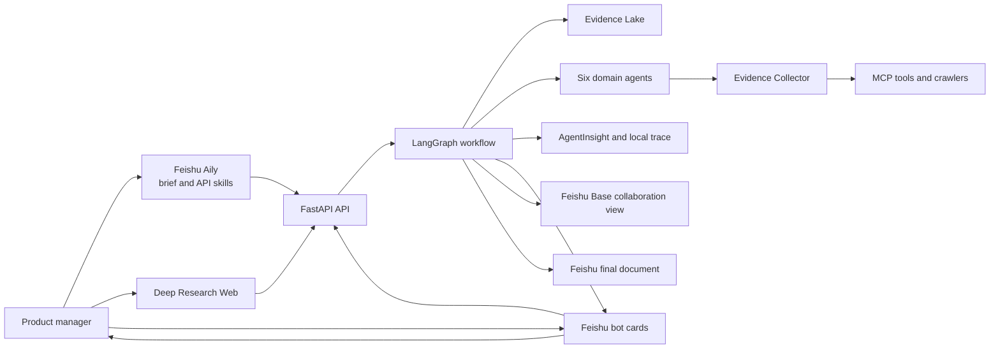
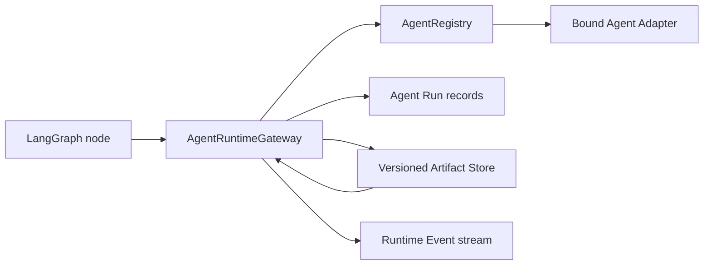

# Architecture

## System context

Feishu is the collaboration layer, not a reasoning or persistence authority. Aily clarifies intent and invokes stable API skills; cards carry progress and human decisions; Base mirrors collaboration summaries; Docs stores the approved proposal. The backend database, Evidence Lake and workflow checkpoints remain the sources of truth.

## Runtime boundaries

- `frontend`: user interaction and visualization only;
- `api`: authentication, validation, commands, queries and SSE;
- `application`: use cases and orchestration ports;
- `domain`: project, evidence, claim, concept and decision rules;
- `workflows`: LangGraph state and nodes;
- `agents`: role-specific reasoning boundaries;
- `infrastructure`: persistence, queues, crawlers and external clients;
- `integrations`: Feishu, A2A, MCP and AgentInsight adapters.

## Workflow dependency

```mermaid
flowchart LR
    Manager["Research manager"] --> Parallel["Parallel evidence research"]
    Parallel --> UserAgent["User research"]
    Parallel --> Competitor["Competitor research"]
    UserAgent --> EvidenceGate["Evidence gate"]
    Competitor --> EvidenceGate
    EvidenceGate --> Product["Product and technical"]
    Product --> Business["Business assessment"]
    Business --> RedTeam["Red team"]
    RedTeam --> Synthesis["Candidate synthesis"]
    Synthesis --> ScenarioGate["Feishu scenario gate"]
    ScenarioGate --> Validation["Validation dispatch"]
    Validation --> FinalSynthesis["Final synthesis"]
    FinalSynthesis --> FinalGate["Feishu final gate"]
    FinalGate --> Proposal["Recommend, investigate, or do not recommend"]
```

`Validation dispatch` 是候选类型无关的扩展点；当前 Foundation 只验证路由与恢复。Package Risk Intelligence 通过场景晋级后，再由独立 Demo 分支注册对应验证器。

## Agent Runtime Core

工作流节点只依赖统一的 Runtime 协议，不直接依赖模型 SDK、CLI 或 A2A 客户端。Gateway 为每次调用建立独立运行记录，校验输入 Artifact 的项目归属和输出 schema，并保存不可变的版本化 Artifact、Evidence IDs、未知项和输入血缘。超时、取消、未绑定、权限、schema 与 Adapter 错误使用稳定错误码记录；失败调用不生成研究 Artifact。

当前只实现 Runtime Core 和显式 Adapter 注册边界。真实模型调用、外部 Agent Runtime 与竞品 A2A 将在后续分支实现对应 Adapter；生产代码不会回退到测试 Runtime 或伪造研究结果。

## Non-negotiable rules

1. Facts in the final report require valid Evidence IDs.
2. Failed collection attempts are stored as observable data.
3. Brief, concept promotion and final definition are human decision gates.
4. Agents exchange structured schemas rather than unconstrained transcripts.
5. The implemented scaffold remains under `/api/v1`; breaking event-understanding changes are defined under `/api/v2` and must not be advertised before implementation and contract tests are complete.
6. Feishu mirrors collaboration state but never replaces backend persistence or workflow checkpoints.
7. An Innovation requires Event, State, at least two Context signals, Inference, Risk or Value, and Action.
8. A high-severity red-team finding must cause research, revision or rejection before promotion.
