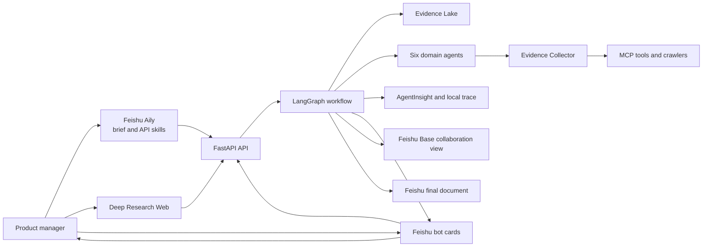
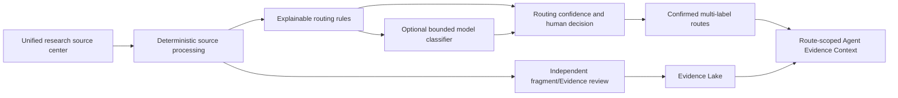
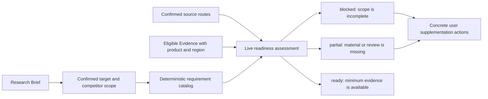
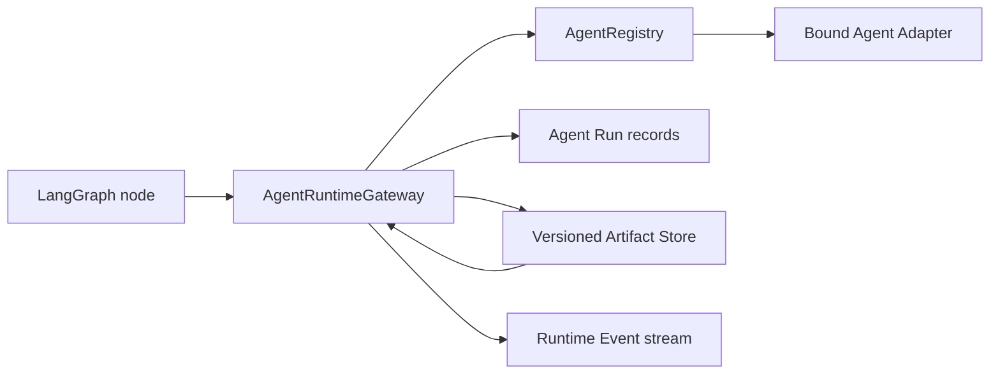
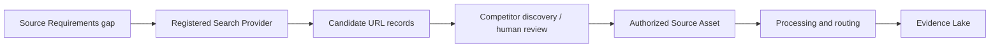
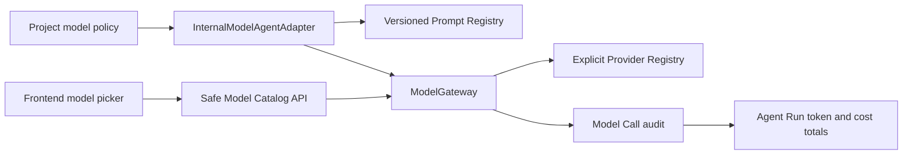

# Architecture

## System context

Feishu is the collaboration layer, not a reasoning or persistence authority. Aily clarifies intent and invokes stable API skills; cards carry progress and human decisions; Base mirrors collaboration summaries; Docs stores the approved proposal. The backend database, Evidence Lake and workflow checkpoints remain the sources of truth.

## Unified source routing

Source routing determines which Agent may inspect a source; it does not validate the source's factual
content. A route can be auto-confirmed only from high-confidence deterministic signals or rule/model
agreement. Evidence promotion remains a separate gate, and downstream factual output still requires
Evidence IDs.

## Source requirement readiness

The requirement layer does not discover competitors, fetch URLs, promote fragments or call a model.
It stores only the user-confirmed product scope and recomputes readiness from current source routing,
processing and Evidence state. A routed source can be shown as detected, but only eligible Evidence
explicitly associated with the exact product can satisfy a requirement. Price evidence is additionally
isolated by the Brief region.

## Runtime boundaries

- `frontend`: user interaction and visualization only;
- `api`: authentication, validation, commands, queries and SSE;
- `application`: use cases and orchestration ports;
- `domain`: project, evidence, claim, concept and decision rules;
- `workflows`: LangGraph state and nodes;
- `agents`: role-specific reasoning boundaries;
- `infrastructure`: persistence, queues, crawlers and external clients;
- `integrations`: Feishu, A2A, MCP and AgentInsight adapters.

## Workflow dependency

```mermaid
flowchart LR
    Manager["Research manager"] --> Parallel["Parallel evidence research"]
    Parallel --> UserAgent["User research"]
    Parallel --> Competitor["Competitor research"]
    UserAgent --> EvidenceGate["Evidence gate"]
    Competitor --> EvidenceGate
    EvidenceGate --> Product["Product and technical"]
    Product --> Business["Business assessment"]
    Business --> RedTeam["Red team"]
    RedTeam --> Synthesis["Candidate synthesis"]
    Synthesis --> ScenarioGate["Feishu scenario gate"]
    ScenarioGate --> Validation["Validation dispatch"]
    Validation --> FinalSynthesis["Final synthesis"]
    FinalSynthesis --> FinalGate["Feishu final gate"]
    FinalGate --> Proposal["Recommend, investigate, or do not recommend"]
```

`Validation dispatch` 是候选类型无关的扩展点；当前 Foundation 只验证路由与恢复。Package Risk Intelligence 通过场景晋级后，再由独立 Demo 分支注册对应验证器。

## Agent Runtime Core

工作流节点只依赖统一的 Runtime 协议，不直接依赖模型 SDK、CLI 或 A2A 客户端。Gateway 为每次调用建立独立运行记录，校验输入 Artifact 的项目归属和输出 schema，并保存不可变的版本化 Artifact、Evidence IDs、未知项和输入血缘。超时、取消、未绑定、权限、schema 与 Adapter 错误使用稳定错误码记录；失败调用不生成研究 Artifact。

当前已经实现 Runtime Core、真实 Model Gateway、受控 External CLI Runtime、竞品主管与三类专家的 A2A 并行运行底座，以及官方产品专家。价格渠道与用户评价专家及其业务 Prompt 仍需在后续分支分别实现；生产代码不会回退到测试 Runtime 或伪造研究结果。

## Search Discovery Connector

搜索发现和证据采集严格分层。当前 Tavily Connector 只调用固定 Search API 并返回
`candidate_only` URL；它不抓取网页正文，不调用业务模型，也不创建 Source Asset 或
Evidence。密钥缺失、认证失败、限流、超时和 Provider 错误均保存为项目运行记录。候选
必须经过后续竞品确认、授权资料接入和完整 Evidence 门禁，才能交给领域 Agent。

## Model Gateway

前端只提交稳定的 `model_id`，不会接触 API Key、Provider 内部模型名或凭据环境变量名。项目保存默认模型和可选 Agent 覆盖；已经完成的 Agent Run 保留实际模型与 Prompt 版本，后续切换只影响新运行。

Model Gateway 负责结构化输出 Schema、有限重试、超时、Token 和估算成本。每个 Provider 必须显式注册，密钥按模型定义中的环境变量名在调用时解析。审计表不保存原始 Prompt、响应正文或密钥；未绑定 Provider、缺密钥、缺 Prompt 和无效 Schema 都明确失败，不产生 Artifact。

## Non-negotiable rules

1. Facts in the final report require valid Evidence IDs.
2. Failed collection attempts are stored as observable data.
3. Brief, concept promotion and final definition are human decision gates.
4. Agents exchange structured schemas rather than unconstrained transcripts.
5. The implemented scaffold remains under `/api/v1`; breaking event-understanding changes are defined under `/api/v2` and must not be advertised before implementation and contract tests are complete.
6. Feishu mirrors collaboration state but never replaces backend persistence or workflow checkpoints.
7. An Innovation requires Event, State, at least two Context signals, Inference, Risk or Value, and Action.
8. A high-severity red-team finding must cause research, revision or rejection before promotion.
