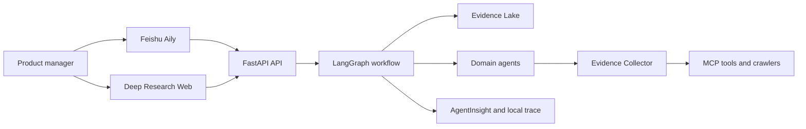

# Architecture

## System context

## Runtime boundaries

- `frontend`: user interaction and visualization only;
- `api`: authentication, validation, commands, queries and SSE;
- `application`: use cases and orchestration ports;
- `domain`: project, evidence, claim, concept and decision rules;
- `workflows`: LangGraph state and nodes;
- `agents`: role-specific reasoning boundaries;
- `infrastructure`: persistence, queues, crawlers and external clients;
- `integrations`: Feishu, A2A, MCP and AgentInsight adapters.

## Non-negotiable rules

1. Facts in the final report require valid Evidence IDs.
2. Failed collection attempts are stored as observable data.
3. Brief, concept promotion and final definition are human decision gates.
4. Agents exchange structured schemas rather than unconstrained transcripts.
5. Public contracts are versioned under `/api/v1`.
