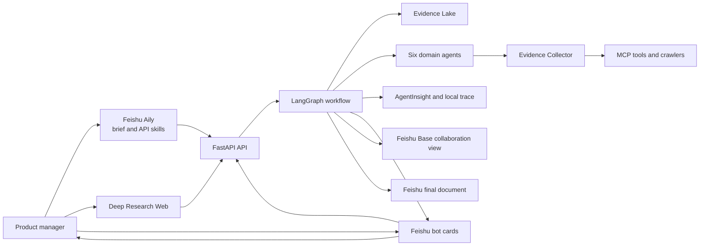

# Architecture

## System context

Feishu is the collaboration layer, not a reasoning or persistence authority. Aily clarifies intent and invokes stable API skills; cards carry progress and human decisions; Base mirrors collaboration summaries; Docs stores the approved proposal. The backend database, Evidence Lake and workflow checkpoints remain the sources of truth.

## Runtime boundaries

- `frontend`: user interaction and visualization only;
- `api`: authentication, validation, commands, queries and SSE;
- `application`: use cases and orchestration ports;
- `domain`: project, evidence, claim, concept and decision rules;
- `workflows`: LangGraph state and nodes;
- `agents`: role-specific reasoning boundaries;
- `infrastructure`: persistence, queues, crawlers and external clients;
- `integrations`: Feishu, A2A, MCP and AgentInsight adapters.

## Workflow dependency

```mermaid
flowchart LR
    Manager["Research manager"] --> Parallel["Parallel evidence research"]
    Parallel --> UserAgent["User research"]
    Parallel --> Competitor["Competitor research"]
    UserAgent --> EvidenceGate["Evidence gate"]
    Competitor --> EvidenceGate
    EvidenceGate --> Product["Product and technical"]
    Product --> Business["Business assessment"]
    Business --> RedTeam["Red team"]
    RedTeam --> ScenarioGate["Feishu scenario gate"]
    ScenarioGate --> Demo["Selected scenario demo"]
    Demo --> FinalGate["Feishu final gate"]
    FinalGate --> Proposal["Recommend, investigate, or do not recommend"]
```

## Non-negotiable rules

1. Facts in the final report require valid Evidence IDs.
2. Failed collection attempts are stored as observable data.
3. Brief, concept promotion and final definition are human decision gates.
4. Agents exchange structured schemas rather than unconstrained transcripts.
5. The implemented scaffold remains under `/api/v1`; breaking event-understanding changes are defined under `/api/v2` and must not be advertised before implementation and contract tests are complete.
6. Feishu mirrors collaboration state but never replaces backend persistence or workflow checkpoints.
7. An Innovation requires Event, State, at least two Context signals, Inference, Risk or Value, and Action.
8. A high-severity red-team finding must cause research, revision or rejection before promotion.
