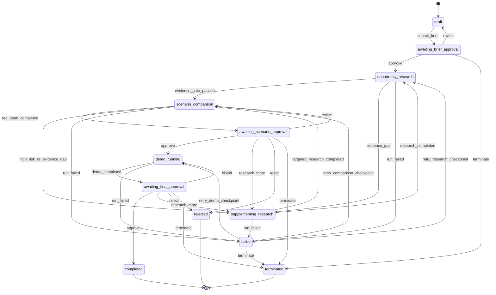

# Project State Machine

## Project states

`completed` 表示最终审批同意进入下一阶段产品验证，不等同于产品已经正式上架；`rejected` 表示系统形成可审计的“不建议立项”结论；`terminated` 表示用户主动终止，不能与研究否定结论混用。

## Human decision gates

| Gate | 暂停状态 | 飞书展示 | 允许操作 | 恢复目标 |
|---|---|---|---|---|
| Brief | `awaiting_brief_approval` | 标准化范围、来源、约束、预算 | `approve/revise/terminate` | 行业机会研究、Brief 修改或终止 |
| Scenario | `awaiting_scenario_approval` | 至少三个候选、Evidence 覆盖、评分、红队意见 | `approve/research_more/revise/reject/terminate` | Demo、补研、重新比较、不建议立项或终止 |
| Final | `awaiting_final_approval` | Demo 结果、限制、失败来源、建议类型 | `approve/research_more/revise/reject/terminate` | 完成、补研、重跑 Demo、不建议立项或终止 |

每个 Gate 必须保存 `decision_id`、允许操作、操作者、理由、选中 Innovation、影响任务和恢复 Checkpoint。重复或过期决定返回冲突错误，不得重复恢复工作流。

## Workflow rules

1. 状态只能由应用服务或工作流节点按上图转换，API 路由不能直接修改状态。
2. 所有转换都写入持久化事件，包含 actor、reason、trace_id 和 checkpoint_id。
3. `failed` 必须保存原失败阶段；重试只能恢复该阶段的最近有效 Checkpoint。
4. `supplementing_research` 只运行缺失或受红队影响的任务。
5. 没有通过 Evidence Gate 和 Event Understanding Gate 的候选不能进入 `awaiting_scenario_approval`。
6. 场景审批至少展示三个候选或说明为什么证据只支持更少候选；系统不得用 Mock 补足数量。
7. 最终审批必须允许输出 `rejected`，不得为了 Demo 强行进入 `completed`。
