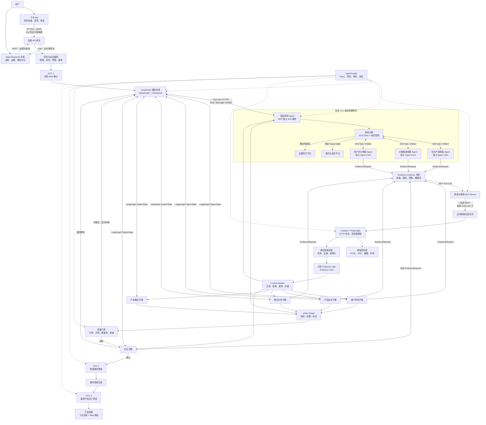
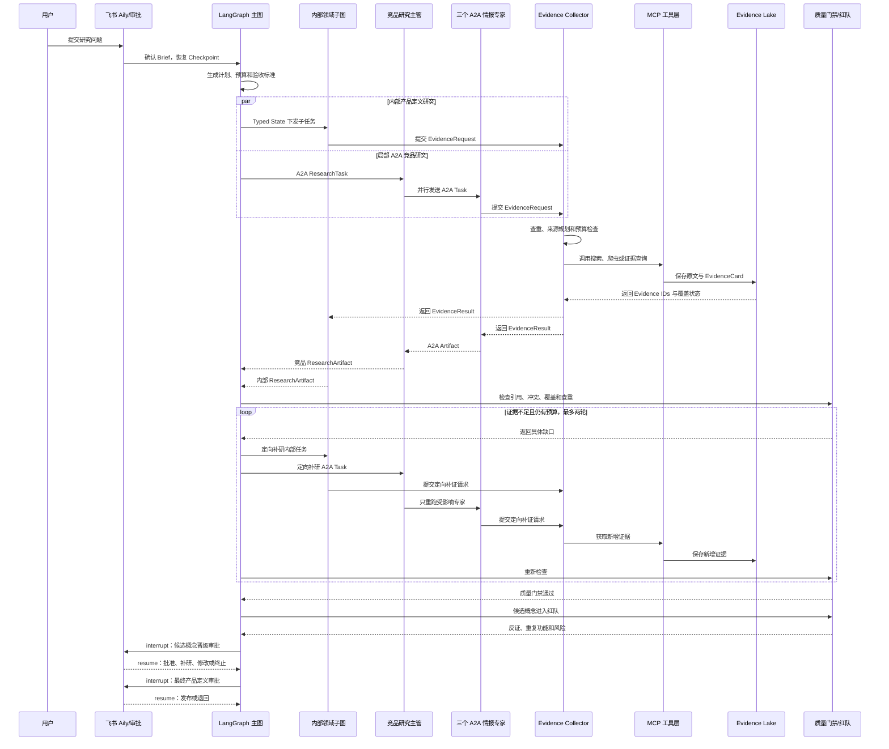

# AgentInsight × Anker eufy：AI 原生产品定义实验方案

> 
> 研究品类：北美智能家居，优先研究 eufy 家庭安防
> 初始验证方向：从高频家庭事件中寻找可由“检测并通知”升级为“事件理解与行动建议”的机会
> 文档状态：竞赛开题、系统架构与原型设计依据，最终产品方向须由用户证据和实验结果决定  
> 技术状态：本章描述已经确定的目标架构与 MVP 边界；实际完成度以可运行代码和现场演示为准

## 一、项目摘要

本项目不是让 AI 自动写一份市场报告，而是搭建一支可运行、可追踪、会互相质疑的“AI 虚拟产品团队”，重新完成一次从用户问题发现到产品定义的全过程。

用户可以在飞书 Aily 中提出一个模糊问题，例如：

> eufy 在北美家庭安防市场还有什么值得做的新产品？

飞书 Aily 首先帮助用户明确品类、目标用户、地区、价格和约束，再调用自研 Agent 后端。调研总管 Agent 将任务拆解给用户研究、竞品、产品技术、商业和红队专家；所有专家共享同一套证据库，每条结论都必须关联原始来源、时间、适用范围和可信度。Deep Research 页面实时展示研究计划、数据覆盖、证据冲突、候选概念及淘汰原因，最终生成一份可追溯的产品提案，并通过飞书文档和审批完成团队协作与决策留痕。

本项目同时完成安克命题要求的两项交付：

1. 设计并演示一套“AI 原生”的产品设计与定义工作流，并用它产出一份 eufy 产品提案；
2. 通过同题对照实验，说明 AI 驱动与传统经验驱动在效率、证据质量、方案可追溯性和产品判断上的差异。

当前报告将北美家庭安防作为优先研究品类，将一户建、双职工、独居、租房等作为可由证据识别的用户标签，而不预设唯一用户群体或最终产品。系统必须先证明某个高频家庭事件存在足够强、足够普遍、且 eufy 尚未充分解决的事件理解缺口，才允许进入产品定义阶段。

## 二、为什么选择 eufy 家庭安防

### 2.1 市场仍在增长，但宏观规模只用于判断方向

Fortune Business Insights 将 2025 年全球智能家居市场估值为 1475.2 亿美元，预计 2034 年达到 8484.7 亿美元；MarketsandMarkets 则将 2025 年市场估值为 2137.3 亿美元，预计 2032 年达到 4502 亿美元。两家机构的统计边界、品类划分和预测模型不同，因此这些数字不能简单视为同一市场的上下限，也不应直接用于产品销量预测。

本项目只使用宏观市场数据回答“该领域是否值得研究”，不会用它替代用户需求验证。

### 2.2 用户更在意易用、月费和安装门槛

SafeHome.org 于 2026 年对 2435 名美国成年人进行调查，得到以下结果：

- 61% 的美国家庭拥有至少一台安防摄像头；
- 48% 的美国家庭拥有视频门铃；
- 49% 的报警系统用户自行安装，42% 选择专业安装；
- 用户选择家庭安防产品时最重视易用性（50%）、月费（46%）和自安装难度（31%）；
- 49% 的摄像头或门铃用户偏好云端与本地混合存储，32% 使用纯云存储，19% 使用纯本地存储；
- 6% 的用户在过去一年取消或降级了付费订阅。

需要注意：上述数据代表 SafeHome 美国调查样本，不等同于全球市场份额。

### 2.3 用户细分必须由事件证据确定

同一调查显示，美国租房用户的摄像头采用率由上一年的 42% 上升至 54%；在尚未使用安防设备的人群中，租房用户未来一年购买视频门铃的意向为 27%，高于房主的 19%。这提示租房用户值得保留为一个候选细分，但不能由此推断整个项目只应服务租房用户。系统需要同时识别一户建、双职工、独居、老人、儿童、宠物和租房等多标签场景，并判断哪些用户在高频家庭事件中承担了最明确的判断成本。

租房用户可能存在的一组需求包括：

- 不允许打孔或改变房屋结构；
- 搬家时希望设备和设置能够快速迁移；
- 对硬件投入和持续订阅更敏感；
- 与室友、房东共享空间时更关注隐私边界；
- 需要简单安装，但不能牺牲稳定性和证据保存。

这些仍是待验证假设，必须通过真实评价、社区讨论、用户访谈和竞品体验进一步确认。

### 2.4 eufy 已具备本地化优势，但不能把现有路线包装成新创意

eufy 已经将本地存储、可扩展 HomeBase、免强制月费和本地 AI 作为重要卖点。2025 年发布的 eufy AI Core 已经覆盖复杂风险识别、降低误报、分级响应、快慢双路径判断、多模态感知和本地处理；eufyCam E40、SoloCam E42 与 HomeBase S380 也已经支持跨设备视频拼接、事件摘要、人脸识别和本地扩展存储。

因此，以下方向不能直接作为本项目的“新产品创新点”：

- 泛泛提出本地 AI；
- 泛泛提出减少误报；
- 泛泛提出跨摄像头追踪；
- 泛泛提出 HomeBase 成为智能中枢；
- 泛泛提出包裹识别或 Delivery Guard。

如果继续研究这些方向，必须找到现有产品尚未解决的具体缺口，例如解释性、家庭成员权限、租房迁移、弱网可用性、低成本证据保存或跨品类联动的真实失败场景。

## 三、核心研究问题与边界

### 3.1 核心问题

> 北美家庭安防中，哪些高频家庭事件目前只能被设备检测和通知，却仍需要用户手动结合事件状态、家庭状态与外部环境完成判断；eufy 是否能将其中一个事件升级为具有风险或价值判断和行动建议的事件理解体验？

### 3.2 本轮研究范围

- 地区：美国和加拿大，优先美国；
- 用户：北美家庭安防用户；优先从一户建、双职工、独居、老人家庭、儿童家庭、宠物家庭和租房用户等多标签场景中识别证据充分的细分；
- 品类：门铃、摄像头、本地存储中枢及相关软件体验；
- 场景：包裹、车库门、门口访客与徘徊等可形成 Event、State、Context、Inference、Risk 和 Action 的高频家庭事件；
- 竞品：Ring、Google Nest、Reolink、Wyze、TP-Link/Tapo、Arlo 等；
- 时间：以最近两至三年的产品、评价和行业信息为主；
- 排除：本轮不研究扫地机器人，也不将整个 eufy 生态重构作为单次产品定义目标。

### 3.3 待验证假设

- H1：现有家庭安防产品在部分高频事件中仍停留于检测和通知，用户需要手动组合状态与上下文完成判断；
- H2：至少存在一个同时具备真实用户痛点、竞品事件理解缺口和可执行行动建议的家庭事件；
- H3：包裹、车库门和陌生人徘徊等候选场景可以按照统一证据、技术、商业和 Demo 可行性标准比较；
- H4：eufy 的现有门铃、摄像头、本地处理或家庭中枢能力可能支撑差异化，但所有设备能力、接口与复用假设必须由官方证据验证；
- H5：Package Risk Intelligence 可能适合作为首个 Demo，但只有通过证据门禁、红队挑战和人工晋级后才能进入验证。

任何假设在证据不足时只能标记为“待验证”，不得由 Agent 自动升级为事实。

## 四、AI 原生产品定义工作流

### 4.1 系统组成

项目由四层组成：

1. **飞书协作层**：Aily 负责发起任务、澄清需求、查询进度和总结结果；多维表格、审批和文档负责协作与留痕；
2. **Agent 编排层**：自研后端负责规划、路由、状态管理、工具调用、重试和人工决策门；
3. **证据与知识层**：统一保存来源、原文、产品、用户群体、时间、抓取状态、可信度和冲突关系；
4. **可观测与评测层**：AgentInsight 记录 Agent、工具、RAG、模型、Prompt、成本、延迟、错误和评测结果。

AgentInsight 在本项目中承担全链路可观测、评测、Prompt 版本和实验管理，不替代 Agent 编排引擎。

### 4.2 已确定的后端架构

项目采用“分层混合协议”设计，而不是让所有节点自由对话：

- 用户与飞书通过 HTTPS/JSON 进入系统；
- Deep Research 页面通过 REST 创建和查询任务，通过 SSE 接收单向实时进度；
- LangGraph StateGraph 是主体编排引擎，通过 Typed State、条件边、子图和 Checkpoint 管理项目；
- 只有竞品研究领域使用 A2A：调研总管调用竞品研究主管，竞品主管再调用三个可独立部署的情报专家；
- 用户研究、产品技术、商业、产品概念和红队保持为 LangGraph 内部子图；
- 用户、竞品、技术、商业和红队通过 EvidenceRequest 向统一采集子图提出需求，只有 Evidence Collector 通过 MCP 调用外部工具；
- 爬虫通过异步任务队列运行，原文和结构化结果进入共享 Evidence Lake；
- AgentInsight 旁路记录整条调用链，不参与业务调度。

本项目不追求“全量 A2A”。A2A 只用于具备独立能力、任务生命周期、Agent Card 和复用价值的竞品情报专家；其他领域 Agent 高频共享同一个产品项目状态，使用 LangGraph StateGraph 更容易控制上下文、循环、失败恢复和 Human in the Loop。它们通过 `ResearchTask`、`ResearchArtifact` 和 `ProjectState` 交换结构化结果，不进行无边界的自由聊天。



### 4.3 大 Agent 与内部小专家

| Agent | 角色 | 主要输入 | 主要输出 |
|---|---|---|---|
| 调研总管 Agent | AI 项目经理 | 用户任务、范围、约束 | 研究计划、任务分配、补充调研决策 |
| 用户研究 Agent | 用户研究员 | 评价、社区讨论、访谈、问卷 | 用户任务、痛点聚类、使用场景、原始用户证据 |
| 竞品 Agent | 行业分析师 | 官方参数、价格、订阅、说明书、评价 | 竞品矩阵、替代方案、现有能力边界 |
| 产品技术 Agent | 产品经理与工程师 | 用户洞察、竞品、技术资料 | 候选产品概念、MVP、技术约束和成本假设 |
| 商业 Agent | 商业分析师 | 定价、订阅、渠道和TCO数据 | 商业模式、价格区间、三年总拥有成本假设 |
| 红队 Agent | 反方评审 | 全部候选结论和概念 | 伪需求、证据缺口、重复产品、不可行点 |
| 决策 Agent | 评审主持人 | 结构化证据与专家评分 | 继续、补研、修改或淘汰，并记录理由 |

除竞品 A2A 情报专家外，“小专家”是拥有独立角色提示词、工具权限、输入输出 Schema 和质量标准的 LangGraph 节点，不是单独部署的模型服务。多个节点可以复用同一个模型，但不能共享未经整理的隐藏思考过程。

| 大 Agent | 控制节点 | 内部小专家 | 是否允许调用爬虫 |
|---|---|---|---|
| 用户研究 Agent | 用户研究主管 | 来源规划、VOC 抽取、用户分群、JTBD、样本偏差审计 | 来源规划和 VOC 专家可以 |
| 竞品研究 Agent | 竞品主管 | 三个 A2A 专家：官方产品情报、价格渠道情报、用户评价情报；两个内部节点：差异化综合、证据审计 | 三个 A2A 专家通过 EvidenceRequest 申请资料 |
| 产品技术 Agent | 产品技术主管 | 机会综合、产品概念、体验流程、硬件、AI 算法、隐私安全、成本 | 技术资料专家可以 |
| 商业 Agent | 商业主管 | 市场范围、定价与 TCO、订阅模式、渠道、增长指标 | 必要时调用公开数据工具 |
| 红队 Agent | 红队主管 | 证据攻击、现有产品查重、技术反证、隐私合规、反事实用户 | 原则上只读证据库 |
| 决策 Agent | 阶段门控制器 | 风险收益、停止条件、人工意见整理 | 不直接调用爬虫 |

### 4.4 不把所有步骤都做成 Agent

以下工作由确定性程序或工具完成：

- 网页请求和浏览器渲染；
- 内容解析、语言识别和时间归一化；
- URL规范化、内容Hash和近重复去重；
- 商品参数结构化；
- 抓取状态、引用和数据覆盖率计算；
- 数据导出和文档生成。

Agent 只负责需要综合判断、解释冲突、产生假设和做决策的工作，避免“为了多 Agent 而多 Agent”。

### 4.5 共享证据库，而不是每个专家各建一套事实库

所有专家共享同一个 Evidence Lake。每条证据至少包含：

- `source_url`：原始来源；
- `source_domain`：来源域名；
- `source_type`：官方、研究报告、电商评价、社区、应用商店、访谈等；
- `published_at` 与 `collected_at`；
- `product`、`region`、`user_segment`；
- `original_excerpt`：原始引用；
- `claim_type`：事实、用户观点、厂商宣传或 Agent 推断；
- `authority_score`、`recency_score`、`diversity_score`；
- `crawl_status`；
- 与其他证据的支持、重复或冲突关系。

每个专家可以拥有独立的专业知识包和评估规则，但不能各自保存互相矛盾的事实副本。例如，用户研究 Agent 使用 JTBD 和需求聚类方法，技术 Agent 使用功耗、网络、隐私和硬件可行性量表。

### 4.6 阶段门控制

系统不能直接从搜索结果跳到产品方案，必须经过以下阶段：

```text
研究范围确认
→ 数据覆盖检查
→ 用户问题形成
→ 竞品与现有产品查重
→ 三个候选概念
→ 技术/商业评估
→ 红队挑战
→ 人工审批
→ 最终产品定义
```

每一阶段都设置“通过、补充调研、退回、终止”四种状态。

### 4.7 通信协议与使用边界

| 通信双方 | 已确定协议 | 主要载荷 | 使用方式 |
|---|---|---|---|
| 飞书 Aily → 后端 | HTTPS + JSON | 结构化 Brief、用户身份、任务参数 | 通过 Aily 自定义连接器调用后端任务 API |
| Deep Research 页面 → 后端 | REST | 创建任务、查询证据、提交审批 | 普通请求使用 REST |
| 后端 → Deep Research 页面 | SSE | Agent 状态、工具调用摘要、覆盖率、阶段结果 | 单向实时推送；MVP 不引入 WebSocket |
| 调研总管 ↔ 竞品 Agent | A2A over HTTPS | Agent Card、Task、Message、Artifact、状态 | 竞品 Agent 独立部署，具备自己的任务生命周期 |
| 竞品主管 ↔ 三个情报专家 | A2A over HTTPS | Agent Card、Task、Artifact、任务状态 | 仅官方产品、价格渠道和用户评价专家独立部署 |
| 调研总管 ↔ 其他领域 Agent | LangGraph Typed State | ProjectState、子任务、Artifact、预算和阶段摘要 | 用户、技术、商业、概念和红队作为内部子图 |
| 领域 Agent → 内部小专家 | LangGraph Typed State | 私有子图状态、Evidence IDs、局部结果 | 同一进程内读写受限字段，不使用 A2A |
| 研究 Agent → Evidence Collector | LangGraph Typed State | EvidenceRequest、预算、来源要求 | 用户、竞品、技术、商业和红队提交统一证据请求 |
| Evidence Collector → 爬虫/搜索 | MCP，生产使用 Streamable HTTP | 具有 JSON Schema 的 Tool Call | 只有统一采集子图负责调用外部数据工具 |
| MCP Server → 爬虫 | 内部 REST + 异步任务队列 | Crawl Job、URL 白名单、深度、页面上限 | 立即返回 `crawl_job_id`，避免阻塞模型 |
| LangGraph ↔ 飞书审批 | HTTPS + JSON + Checkpoint | PendingDecision、人工意见、恢复节点 | 图在审批节点 interrupt，收到决定后 resume |
| Agent → AgentInsight | SDK/Trace Event | Run、Task、Tool、Evidence、Claim、成本和延迟 | 旁路记录，不改变业务状态 |

本地开发时 MCP 可以使用 stdio；部署后统一使用 Streamable HTTP。A2A 只用于局部竞品情报网络，MCP 只用于 Agent 调用工具，LangGraph Typed State 只用于同一产品定义工作流内的状态协作，三者不能混用。

### 4.8 A2A 与内部消息对象

调研总管发送给竞品 Agent 的任务至少包含：

```json
{
  "task_id": "COMP-001",
  "project_id": "EUFY-001",
  "goal": "比较 eufy 与主要竞品在北美租房安防场景中的能力缺口",
  "scope": {
    "region": ["US", "CA"],
    "time_range": "最近三年",
    "competitors": ["Ring", "Arlo", "Reolink", "Wyze", "Tapo"]
  },
  "required_artifacts": [
    "competitor_matrix",
    "existing_feature_check",
    "opportunity_gaps"
  ],
  "evidence_rules": {
    "minimum_independent_domains": 2,
    "citation_required": true
  },
  "budget": {
    "max_crawl_pages": 100,
    "max_research_loops": 2
  }
}
```

竞品主管读取三个情报专家的 Agent Card，并基于该任务生成带 `parent_task_id` 的官方产品、价格渠道和用户评价子任务。三个 A2A 专家并行执行，只返回结构化 Artifact 和 Evidence IDs；差异化综合与证据审计仍在竞品主管内部完成，不再继续拆成远程 Agent。

竞品 Agent 返回的 Artifact 不只是报告文本，而是可被机器继续处理的结构化结果：

```json
{
  "artifact_type": "competitor_research",
  "task_id": "COMP-001",
  "findings": [],
  "evidence_ids": [],
  "contradictions": [],
  "unknowns": [],
  "coverage": {},
  "quality_status": "pass_or_needs_research"
}
```

所有内部 Agent 使用同一组基础对象：

- `ProjectState`：LangGraph 主图中经过 Schema 校验的项目共享状态；
- `ResearchTask`：要完成什么、范围、预算和验收标准；
- `EvidenceRequest`：研究 Agent 提交给统一采集子图的证据需求；
- `EvidenceResult`：采集完成后返回的 Evidence IDs、覆盖情况和未知项；
- `EvidenceCard`：原始来源、引用片段、时间、抓取状态和内容 Hash；
- `Claim`：结论、支持证据、反对证据、适用范围和状态；
- `ResearchArtifact`：某个 Agent 的结构化交付；
- `StageDecision`：批准、补研、修改、淘汰或终止及其理由；
- `PendingDecision`：Human in the Loop 暂停时等待飞书回传的决定。

### 4.9 Context Engineering

主体编排使用 LangGraph StateGraph。主图维护经过 Schema 校验的 `ProjectState`，用户研究、产品技术、商业、产品概念和红队分别作为子图运行；节点只读取允许字段并返回状态增量，不互相传递自由格式的长对话。每个阶段写入 Checkpoint，支持失败恢复、人工暂停和定点重跑。

系统不把全部聊天记录、全部网页和其他 Agent 的完整输出塞给每个 Agent。Context Builder 在每一步重新组装最小必要上下文：

1. **固定规则层**：角色、工具权限、安全边界、输出 Schema、引用要求和停止条件；
2. **项目任务层**：目标用户、地区、品类、时间、预算和当前研究问题；
3. **Evidence Pack**：与当前子任务相关、已去重且包含反方材料的证据卡片；
4. **工作状态层**：已经完成的任务、未解决冲突、剩余预算和下一步；
5. **阶段摘要层**：结论、Evidence IDs、未知问题和决策，不保存或传播隐藏思维过程。

Evidence Pack 的构建流程为：

```text
按项目/产品/地区/时间/来源类型过滤
→ 关键词与向量混合检索
→ 相关性重排
→ 来源去重与域名多样化
→ 主动加入反对证据
→ 压缩为带 Evidence ID 的上下文包
```

记忆分成三类：

- 工作记忆：本轮 Typed State，只保留当前步骤需要的字段；
- 项目记忆：阶段摘要、任务状态和人工决策；
- 长期事实库：共享 Evidence Lake 中的原文和结构化证据。

主图只保存跨领域需要共享的 Brief、Artifact、Evidence IDs、Claims、Contradictions、Concepts、Budget、Iteration 和 ApprovalStatus；各子图的临时草稿留在私有状态中。每轮结束后写入结构化 `StepSummary`，淘汰临时草稿和重复材料。不同专家拥有不同检索策略和专业知识包，但共享同一事实库，不为每个专家复制一套 RAG。

### 4.10 有限状态 Agent Loop



Agent Loop 是由后端状态机控制的“计划—执行—检查—定向补充—停止”，不是让模型无限自我反思。MVP 设定最多两轮证据补充和一轮红队修改，并同时设置页面数、Token、时间和费用预算。

出现以下任一情况即停止：

- 质量门禁通过；
- 达到循环或预算上限；
- 新一轮没有产生有效新证据；
- 关键数据无法合规获得；
- 需要用户做价值判断；
- 证据证明不值得立项。

证据仍不足时输出“未知、待验证或不建议立项”，不得为了完成流程强行生成答案。

### 4.11 Human in the Loop 与 Checkpoint

Human in the Loop 不是最终报告上的一次确认，而是 LangGraph 状态机中的正式暂停和恢复机制。主图在三个固定节点执行 interrupt，并将 `PendingDecision`、`checkpoint_id`、可选操作和恢复节点写入项目状态：

1. **研究 Brief 确认**：用户确认目标用户、地区、品类、时间、约束和预算后才启动研究；
2. **候选概念晋级**：红队评审后，用户选择批准、补研、修改、淘汰或全部不立项；
3. **最终产品定义审批**：用户确认 MVP、风险、未知假设和成功指标后才生成正式飞书文档。

遇到权威来源冲突、需要登录或付费数据、即将超预算、重大隐私风险或必须进行价值取舍时，系统还可以动态暂停。飞书审批通过 HTTPS/JSON 将结构化决定写回后端，LangGraph 从 Checkpoint 恢复，并只重跑受影响节点。

自动门禁负责引用、Schema、覆盖率、日期、数字和查重；人类负责研究方向、产品价值、风险接受和是否立项。人工意见必须保存为 `StageDecision`，成为后续上下文和审计记录的一部分。

### 4.12 防幻觉与安全控制

防幻觉不能只依赖另一个 LLM 审核，而应由数据结构、确定性校验、红队和人工决策共同完成：

1. **事实、洞察、假设、概念分层**：事实必须被来源直接支持；洞察需要多条证据归纳；假设必须标记待验证；概念允许创造但不能伪装成用户事实；
2. **Claim—Evidence 强绑定**：每条事实性 Claim 必须包含支持 Evidence IDs、反方 Evidence IDs、地区、时间和适用用户；
3. **保存原文快照**：记录 URL、抓取时间、引用片段、内容 Hash 和解析器版本，支持回查和复现；
4. **搜索摘要不得晋级**：摘要只用于发现来源，最终结论必须引用原始页面、报告、说明书或可回溯用户原话；
5. **主动检索反证**：Context Builder 必须加入反对材料，红队检查删除单一平台后结论是否改变；
6. **缺失显式化**：`blocked`、`partial`、`paywalled` 等状态进入覆盖率，抓不到不能被解释成不存在；
7. **确定性检查**：程序检查 JSON Schema、引用是否存在、数字和日期是否一致、产品型号是否混淆、是否重复引用同一来源；
8. **最终引用检查**：报告中的关键事实句必须能映射到 Claim 和 EvidenceCard，映射失败则退回；
9. **人工阶段门**：范围、概念晋级和最终产品定义必须经过飞书审批。

外部网页属于不可信输入，还需要防止 Prompt Injection：

- 网页文本只能作为被明确分隔的数据，不得修改 Agent 角色和系统指令；
- 清除脚本、隐藏元素和无关导航，只保留必要正文和元数据；
- MCP 使用工具白名单、域名范围、页面数量和权限限制；
- 阻止访问内网地址、云元数据地址和未授权文件；
- 不把密钥、Cookie 或其他用户数据写入模型上下文；
- 高风险或需要登录的操作必须人工授权。

### 4.13 AgentInsight 全链路观测

AgentInsight 为每次运行关联以下标识：

```text
Project ID
→ A2A Task ID
→ Agent Run ID
→ Expert Node ID
→ MCP Tool Call ID
→ Crawl Job ID
→ Evidence ID
→ Claim ID
→ Concept ID
```

重点监控引用覆盖率、无证据 Claim 数量、冲突解决率、来源覆盖率、循环次数、Token、费用、耗时和失败工具。AgentInsight 用于发现问题和比较实验，不直接决定业务结论，也不充当编排器。

## 五、数据采集与反爬缺失治理

### 5.1 采集原则

本项目不以绕过验证码、登录、付费墙或网站访问控制为目标。优先使用官方 API、RSS、站点地图、公开产品页、说明书、授权导出和合规数据服务，并遵守目标网站条款与访问频率限制。

### 5.2 已确定的爬虫技术栈与工具边界

MVP 使用 Python 技术栈：

- **Crawlee for Python**：负责任务队列、URL 去重、并发、深度限制、重试、会话和抓取状态；
- **AdaptivePlaywrightCrawler**：先尝试普通 HTTP，页面依赖 JavaScript 时再降级到 Playwright；
- **BeautifulSoup 或 Parsel**：解析普通 HTML；
- **Playwright**：只用于公开但需要浏览器渲染的动态页面；
- **PDF 解析器**：处理说明书、研究报告和产品手册；
- **PostgreSQL + pgvector**：保存结构化 EvidenceCard、Claim 和向量索引；
- **对象存储**：保存 HTML、PDF、截图和原始快照；
- **异步任务队列**：隔离耗时爬取任务，MVP 可使用 Redis 支持的轻量队列。

爬虫是确定性公共服务，不属于某一个 Agent。用户研究、竞品、技术和商业节点不直接控制爬虫，而是向统一 Evidence Collector 子图提交 EvidenceRequest；只有 Evidence Collector 通过同一个 MCP Server 调用搜索、爬虫、PDF 和证据查询工具。产品概念和决策节点只读取审核后的证据，红队发现缺口时提交补证请求。

MCP Server 暴露的核心工具为：

```text
source_discover       发现候选来源，只返回链接和元数据
crawl_submit          创建异步爬取任务
crawl_status          查询任务状态与覆盖情况
crawl_result          获取 Evidence IDs，不返回整站全文
fetch_public_page     获取单个公开页面
extract_product_spec  按 Schema 抽取产品参数
extract_user_review   抽取用户原话、评分、时间和产品
evidence_query        从共享证据库检索证据卡片
```

典型调用：

```json
{
  "tool": "crawl_submit",
  "arguments": {
    "seed_urls": ["https://example.com/product"],
    "source_type": "official_product",
    "allow_domains": ["example.com"],
    "max_pages": 20,
    "max_depth": 2,
    "render_policy": "auto"
  }
}
```

MCP 立即返回 `crawl_job_id`，爬虫在后台执行。任务完成后只返回 Evidence IDs、成功数、部分成功数和失败数；完整网页留在原始资料库，避免模型上下文被整页内容撑满。

### 5.3 Evidence Collector 统一证据采集子图

Evidence Collector 是 LangGraph 中唯一负责外部证据获取的子图，处理流程为：

```text
接收 EvidenceRequest
→ 查询 Evidence Lake 是否已有可复用证据
→ 规划缺失来源与采集预算
→ 通过 MCP 调用搜索、爬虫、PDF 或授权 API
→ 等待异步 Crawl Job
→ 清洗、解析、去重并生成 EvidenceCard
→ 计算来源覆盖和失败状态
→ 返回 EvidenceResult
```

EvidenceRequest 至少包含：

```json
{
  "request_id": "ER-001",
  "project_id": "EUFY-001",
  "requester": "user_research_agent",
  "research_question": "目标用户在安装家庭安防设备时遇到什么问题",
  "source_types": ["official", "review", "community", "report"],
  "filters": {
    "region": ["US", "CA"],
    "time_range": "最近三年",
    "products": []
  },
  "required_fields": ["original_excerpt", "published_at", "product"],
  "freshness": "recent",
  "max_pages": 50,
  "evidence_rules": {
    "minimum_independent_domains": 2,
    "citation_required": true
  }
}
```

EvidenceResult 返回：

```json
{
  "request_id": "ER-001",
  "evidence_ids": [],
  "coverage": {
    "independent_domains": 0,
    "source_types": 0
  },
  "blocked_sources": [],
  "unknowns": [],
  "quality_status": "pass_or_needs_research"
}
```

统一采集子图负责 URL 缓存、内容 Hash、来源配额、页面上限、合规限制和失败状态，避免不同 Agent 重复抓取同一页面或形成互相冲突的私有资料库。

### 5.4 合规降级链路

```text
官方API/RSS/结构化页面
→ 普通网页请求
→ 合规浏览器渲染
→ 同一事实的其他权威来源
→ 用户上传或授权导出
→ 标记为不可获得
```

搜索结果摘要只能用于发现来源，不能单独作为关键结论的最终证据。

### 5.5 抓取失败必须成为数据的一部分

每个来源记录以下状态之一：

- `success`：完整获取；
- `partial`：只获得部分内容；
- `blocked`：被访问控制阻断；
- `login_required`：需要登录；
- `paywalled`：位于付费墙后；
- `timeout`：请求超时；
- `parse_failed`：页面获得但解析失败；
- `stale`：内容过旧；
- `duplicate`：与已有来源重复。

“没有抓到负面评价”不得被解释为“没有负面评价”；抓不到的数据统一视为未知。

### 5.6 证据晋级条件

一条用户洞察要进入最终提案，原则上至少满足：

- 来自两个独立域名；
- 至少包含两种来源类型；
- 至少包含一条可回溯的用户原话；
- 与官方参数或产品能力没有明显冲突；
- 不是转载或重复评论；
- 时间、地区和目标用户基本匹配。

不满足条件的内容只能保留为研究假设。

### 5.7 来源平衡与结论稳定性

系统需要展示：

- 各平台、地区、产品和时间段的覆盖情况；
- 成功、部分成功和阻断来源比例；
- 官方资料与用户资料的占比；
- 支持证据和反对证据数量；
- 删除单一平台后，机会排序是否改变。

建议的洞察可信度计算框架为：

```text
洞察可信度 = 来源权威性 × 来源多样性 × 时间新鲜度 × 样本覆盖度 × 引用一致性 × 结论稳定性
```

该分数只用于风险提示和排序，不应伪装成统计学置信区间。

## 六、Deep Research 页面设计

### 6.1 新建研究任务

用户输入品类、目标用户、地区、场景、预算、时间和重点，也可以直接输入自然语言。系统显示 Aily 生成的结构化 Brief，并要求用户确认。

### 6.2 AI 调研现场

展示：

- 调研计划和当前阶段；
- 各 Agent 的任务与状态；
- 已采集、失败和待补充来源；
- 人工暂停、修改范围和补充资料入口；
- 阶段门的通过或退回原因。

页面只展示行动、证据和决策摘要，不展示模型的隐藏思维过程。

### 6.3 用户与证据中心

以证据卡片形式展示原始评价、出处、时间、产品、用户群体和可信度；用户可以查看某个需求由哪些证据支持，也可以标记误判、重复或不适用内容。

### 6.4 产品概念竞技场

系统根据证据生成三个候选概念，并分别展示：

- 目标用户和核心任务；
- 价值主张；
- 核心功能；
- 对应证据；
- 与 eufy 现有产品的差异；
- 技术、成本、隐私和商业风险；
- 各专家支持或反对意见；
- 红队提出的致命问题。

### 6.5 最终提案与方法对比

展示最终产品提案、被淘汰概念及原因、尚未验证的假设，以及 AI 方法和传统方法的对照结果。

## 七、飞书 AI 的实际使用方式

本项目至少实质使用飞书 Aily，不把飞书仅作为链接入口。

### 7.1 飞书 Aily

- 理解用户的模糊研究请求；
- 追问目标用户、地区、品类和限制；
- 生成结构化研究 Brief；
- 通过自定义连接器调用 Agent 后端；
- 查询研究进度和关键结果；
- 根据最终证据生成团队摘要和待决策事项。

### 7.2 飞书多维表格

保存研究任务、来源状态、证据卡片、用户问题、候选概念、专家评分、人工决策和版本记录。多维表格是协作与审计账本，不与后端证据库重复存储全部原始内容。

### 7.3 飞书审批与消息

在研究 Brief 确认、候选概念晋级和最终产品定义三个节点发起人工审批。LangGraph 在这些节点保存 Checkpoint 并暂停；飞书将批准、补研、修改、淘汰或终止等结构化决定传回后端，主图从原位置恢复，只重跑受影响步骤。

### 7.4 飞书文档

自动生成最终产品提案、研究方法、证据目录和对照实验结果，形成可编辑、可评论、可分享的团队资产。

### 7.5 飞书与后端的接口闭环

飞书 Aily 通过自定义连接器调用后端 HTTPS API，建议只暴露少量稳定操作：

| 操作 | 后端接口职责 | 返回内容 |
|---|---|---|
| 创建研究 | 提交结构化 Brief 并创建 Project | `project_id`、状态和 Web 页面地址 |
| 查询进度 | 查询当前阶段和 Agent 状态 | 阶段、覆盖率、待决策事项 |
| 查询结论 | 获取已通过门禁的阶段摘要 | Findings、Evidence IDs、Unknowns |
| 提交决策 | 写入批准、补研、修改、淘汰或终止意见，并恢复 Checkpoint | 新状态、恢复节点和受影响的重跑步骤 |
| 生成提案 | 触发最终报告和飞书文档生成 | 文档地址、版本和质量摘要 |

Deep Research 页面不通过飞书连接器持续轮询，而是直接使用 REST 获取数据、使用 SSE 接收实时进度。飞书负责协作入口、人工决策和结果沉淀，Web 页面负责复杂过程可视化。

## 八、候选事件理解场景：仅作为比较对象

在完成用户证据采集前，不提前宣布最终产品。当前设置三个起始候选场景建立统一比较框架，系统可以依据真实证据替换候选：

### 候选 A：Package Risk Intelligence

以门铃检测到包裹送达为基础事件，结合包裹持续在门口、家庭无人、天气或预计回家时间等上下文，判断包裹受损或持续暴露风险，并提前建议用户处理。

需要验证：用户是否真实承担送达后的判断成本；竞品是否已经提供等价能力；包裹状态、家庭状态和外部数据能否可靠获得；行动建议是否减少而不是增加无效通知。

### 候选 B：Garage Door Risk

以车库门打开为基础事件，结合持续时间、时段、家庭状态和车辆状态，判断是否可能为遗忘或异常开放，并建议用户关闭或确认。

需要验证：事件频率与后果是否足够；相关状态和设备接口是否真实可用；普通定时规则是否已经足够解决问题。

### 候选 C：Loitering Context

以门口检测到人员为基础事件，结合持续或重复停留、配送记录、熟悉访客和时间段等上下文，区分正常经过与需要用户关注的持续徘徊，并给出查看或确认建议。

需要验证：误报和偏见风险；身份、轨迹和配送数据的合规边界；系统是否可能增加焦虑；该场景是否适合比赛阶段验证。

候选必须按照用户痛点、证据强度、竞品差异、事件理解完整度、技术数据可行性、商业价值和 Demo 可行性评分，并接受红队挑战和飞书人工晋级。Package Risk Intelligence 是首选 Demo 候选而非预定答案；若候选均不成立，系统应输出“不建议立项”，而不是强行生成产品。

## 九、最终产品提案应包含的内容

1. 目标用户及筛选标准；
2. 用户任务、场景和失败时刻；
3. 原始用户证据和覆盖情况；
4. 问题严重度、频率和现有替代方案；
5. 产品概念和价值主张；
6. 核心功能与证据对应关系；
7. 用户流程和交互原型；
8. 竞品差异和现有产品查重；
9. 技术、成本、隐私和法规可行性；
10. 三年总拥有成本和商业模式假设；
11. MVP范围、验证方法和成功指标；
12. 已知限制、未知问题和终止条件。

## 十、AI 驱动与传统经验驱动的对照实验

### 10.1 实验设计

对同一个 eufy 产品问题进行两次产品定义：

- **传统组**：产品经理使用常规搜索、表格和个人经验，在限定时间内完成方案；
- **AI组**：产品经理使用本项目的 Aily、Agent 后端、Deep Research 页面和 AgentInsight 完成方案。

隐藏方案来源，由用户研究、产品、工程和商业专家进行盲评。

### 10.2 比较指标

| 指标 | 定义 |
|---|---|
| 完成时间 | 从任务开始到形成可评审提案的时间 |
| 有效证据数量 | 去重后、可回溯且与结论相关的证据数 |
| 引用覆盖率 | 最终关键结论中拥有有效来源的比例 |
| 来源多样性 | 独立域名、来源类型、地区和时间覆盖 |
| 伪需求识别率 | 被后续验证推翻的需求假设比例 |
| 重复产品发现率 | 是否识别 eufy 已发布或在售的相似能力 |
| 技术风险发现率 | 在评审前识别的关键不可行点数量 |
| 决策可追溯性 | 能否说明方案选择、修改和淘汰原因 |
| 方案盲评得分 | 独立评委对用户价值、创新和可行性的评分 |
| 成本与延迟 | 模型、工具和人工投入的总成本及耗时 |

AgentInsight 用于记录两组实验的版本、Trace、模型、Prompt、数据集和评测结果。若 AI 组只是在速度上更快，却没有提升证据质量或产品判断，本项目不能宣称方法更优。

## 十一、MVP 范围与验收标准

### 11.1 端到端工作流

1. 产品经理在飞书 Aily 输入研究问题；
2. Aily 追问并生成结构化 Brief；
3. 用户确认后，Aily 调用 Agent 后端；
4. Deep Research 页面展示计划、Agent 状态和数据覆盖；
5. 调研总管通过 A2A 调用竞品主管，竞品主管再通过 A2A 并行情报专家；专家提交 EvidenceRequest，由 Evidence Collector 通过 MCP 获取资料；
6. 用户研究、产品技术和商业工作流读取同一 Evidence Lake，生成三个候选概念；
7. 红队指出重复产品、证据不足和不可行点；
8. 飞书发起概念晋级审批；
9. 系统根据审批结果补研或生成最终提案；
10. 飞书文档沉淀正式产品提案；
11. 页面展示 AI 组与传统组的对照结果。

MVP 只需完成五个核心页面：新建任务、调研现场、证据中心、概念竞技场、最终提案与方法对比。

### 11.2 Definition of Done

只有同时满足以下条件，MVP 才视为完成：

| 模块 | MVP 验收标准 |
|---|---|
| 飞书 Aily | 能将模糊需求整理为结构化 Brief，并调用后端创建项目 |
| LangGraph 主图 | 能运行完整 StateGraph，支持条件分支、循环上限、Checkpoint 和失败恢复 |
| Human in the Loop | Brief、候选概念和最终产品定义三个节点能够暂停，并根据飞书决定恢复 |
| Evidence Collector | 能接收 EvidenceRequest，执行缓存查重、来源规划、预算控制并返回 EvidenceResult |
| 竞品 A2A | 竞品主管能通过 Agent Card 调用三个情报专家，并收集结构化 Artifact |
| MCP 工具层 | 能完成来源发现、异步爬取、任务状态查询和证据查询 |
| Evidence Lake | 能保存来源、原文、抓取时间、状态、内容 Hash 和 Evidence ID |
| Claim Gate | 没有有效 Evidence ID 的事实性 Claim 无法进入最终提案 |
| Deep Research 页面 | 能展示任务阶段、Agent 状态、数据覆盖、证据卡片、候选概念和审批状态 |
| AgentInsight | 能关联 Project、A2A Task、Agent Run、MCP Tool Call、Crawl Job、Evidence 和 Claim |
| 最终提案 | 关键事实可回溯，未知问题、失败来源、候选概念淘汰原因和人工决定完整保留 |

验收以完整链路可运行和结果可追溯为准，不以 Agent 数量、网页数量或生成文本长度作为完成标准。

## 十二、主要风险与应对

| 风险 | 影响 | 应对 |
|---|---|---|
| 抓取平台集中 | 容易把可访问平台误当成整个市场 | 覆盖矩阵、来源配额和删源稳定性测试 |
| 用户 Agent 凭空模拟 | 将模型偏见误当用户需求 | 用户 Agent 只能基于真实证据聚类进行压力测试 |
| Agent 数量过多 | 成本、延迟和错误传播增加 | 动态路由，只在必要时调用专家 |
| 多套RAG冲突 | 专家引用不同版本的事实 | 使用共享证据库和专家检索策略 |
| 与eufy现有产品重复 | 创新性不足 | 强制执行官方产品查重和红队否决 |
| 市场数据口径混乱 | 规模与机会判断失真 | 记录定义、样本、地区和研究方法 |
| 飞书仅作装饰 | 不满足赛事真实使用要求 | 让Aily实际完成澄清、Brief和结果总结 |
| AgentInsight不可用 | 演示和评测中断 | 后端保留本地Trace、指标和可导出数据 |
| 强行产出方案 | 证据不足仍生成“漂亮答案” | 允许输出“不建议立项”并列明补研条件 |
| A2A 过度服务化 | 部署、鉴权和调试成本超过比赛收益 | A2A 仅用于竞品主管和三个可复用情报专家，其他节点固定为 LangGraph 内部子图 |
| 上下文持续膨胀 | Token、延迟和无关信息不断增加 | 每步重新构建最小上下文，只传 Evidence IDs 和阶段摘要 |
| 网页 Prompt Injection | 外部文本诱导 Agent 越权或泄露数据 | 不可信内容隔离、工具白名单、域名限制和敏感操作人工授权 |

## 十三、预期交付物

1. 可操作的 Deep Research Web 原型；
2. 飞书 Aily 研究入口和自定义连接器；
3. 可运行的多 Agent 后端；
4. 共享证据库及来源覆盖看板；
5. AgentInsight Trace、评测和实验面板；
6. 一份具体的 eufy 产品提案；
7. 一份 AI 原生产品定义方法说明；
8. 一份 AI 驱动与经验驱动的对照实验结果；
9. 飞书多维表格、审批和正式提案文档；
10. 现场演示脚本或演示视频；
11. 一份 A2A Agent Card、MCP 工具清单和端到端 Trace 示例。

## 十四、结论

本项目的价值不在于让多个 Agent 自动生成更长的报告，而在于建立一套“有证据、有反方、有淘汰、有人工决策、可复现”的产品定义机制。

对 eufy 而言，本地存储、低订阅依赖和本地 AI 已经是现有战略，新的产品机会不能停留在重复这些卖点。项目应从真实高频家庭事件出发，验证用户是否仍需手动组合事件状态、家庭状态与外部环境完成判断，并比较多个事件理解候选。只有证据、竞品缺口、数据可得性、技术、商业、红队和人工审批共同通过后，候选才能形成产品建议；若不成立，系统应诚实地停止立项。

与传统方法相比，AI 原生方法的本质差异不是“生成更快”，而是把搜索、证据、用户假设、专家挑战、方案淘汰和决策记录连接成一个可以审计和迭代的系统。飞书负责让这套系统进入真实协作现场，Agent 后端负责执行，AgentInsight负责看清和评测全过程。

技术上，LangGraph 是主体运行时，负责 StateGraph、Typed State、条件分支、Checkpoint、Agent Loop 和 Human in the Loop；A2A 只用于竞品主管与三个独立情报专家之间的委派；所有研究节点通过 EvidenceRequest 进入统一 Evidence Collector，只有该子图通过 MCP 调用搜索、爬虫和证据工具；REST/SSE 处理页面与后端通信。协议服务于边界清晰、可追踪和可演示，而不是为了堆叠技术名词。

## 参考来源

1. 2026 AI先锋未来人才大赛详细赛制规则  
   https://bytedance.larkoffice.com/wiki/EwPtwUn5ciw0UlkF7dDcndyAn1n
2. 飞书Aily：企业级智能体开发平台  
   https://www.feishu.cn/content/3d5z9ttt
3. 飞书Aily自定义连接器  
   https://www.feishu.cn/content/ya5j9hjw
4. Fortune Business Insights, Smart Home Market Size & Share  
   https://www.fortunebusinessinsights.com/industry-reports/smart-home-market-101900
5. MarketsandMarkets, Smart Home Market 2025–2032  
   https://www.marketsandmarkets.com/Market-Reports/smart-homes-and-assisted-living-advanced-technologie-and-global-market-121.html
6. ASHB / Harbor Research, 2025 Smart Home Trends & Technology Adoption Executive Summary  
   https://www.ashb.com/wp-content/uploads/2025/10/Survey-Executive-Summary-3.pdf
7. SafeHome.org, 2026 Home Security Market Report  
   https://www.safehome.org/resources/home-security-industry-annual/
8. NIST SP 1343, Survey on Smart Home Users' Security and Privacy Perceptions and Actions  
   https://www.nist.gov/publications/survey-smart-home-users-security-and-privacy-perceptions-and-actions-device-category
9. Axis Communications, Strategic Insights into the Future of Video Surveillance  
   https://www.axis.com/explore/future-of-video-surveillance
10. eufy, Local Security with No Monthly Fees  
    https://www.eufy.com/eufy-local-security
11. Anker Innovations, eufy AI Core, eufyCam S4 and Smart Home Lineup, 2025-09-04  
    https://www.anker-in.com/posts/eufy-unveils-ai-core-eufycam-s4-and-permanent-outdoor-lights-s4-at-ifa-2025-expanding-its-ai-powered-smart-home-lineup
12. Anker Innovations, eufyCam E40 and SoloCam E42, 2025-07-29  
    https://www.anker-in.com/posts/eufy-launches-eufycam-e40-and-solocam-e42-to-meet-diverse-home-security-needs
13. eufy Support, Introduction to New eufy App  
    https://service.eufy.com/expertsecure-system/article-description/Introduction-to-New-eufy-App
14. eufy Support, Differences Between eufy Security, eufy Clean and EufyLife Apps  
    https://service.eufy.com/article-description/The-Differences-Between-eufySecurity-EufyHome-and-EufyLife-Apps
15. eufy Support, HomeBase Compatibility Guide  
    https://service.eufy.com/article-description/eufy-Security-Complete-HomeBase-Compatibility-Guide
16. AgentInsight, LLM/Agent应用可观测平台  
    https://agentinsight.goldebridge.com/
17. AgentInsight Python SDK  
    https://pypi.org/project/agentinsight-sdk/
18. Agent2Agent Protocol Specification  
    https://github.com/a2aproject/A2A/blob/main/docs/specification.md
19. Model Context Protocol, Architecture Overview  
    https://modelcontextprotocol.io/docs/learn/architecture
20. Model Context Protocol, Official SDKs  
    https://modelcontextprotocol.io/docs/sdk
21. Crawlee for Python  
    https://crawlee.dev/python
22. Crawlee for Python, Adaptive Playwright Crawler  
    https://crawlee.dev/python/docs/next/guides/adaptive-playwright-crawler
23. Crawlee for Python, Storages and RequestQueue  
    https://crawlee.dev/python/docs/guides/storages
24. 飞书开放平台，调用 Aily 技能  
    https://open.feishu.cn/document/aily-v1/app-skill/start?lang=zh-CN
25. 飞书开放平台，事件订阅概述  
    https://open.feishu.cn/document/ukTMukTMukTM/uUTNz4SN1MjL1UzM?lang=zh-CN
26. LangGraph Reference, StateGraph  
    https://reference.langchain.com/python/langgraph/graph
